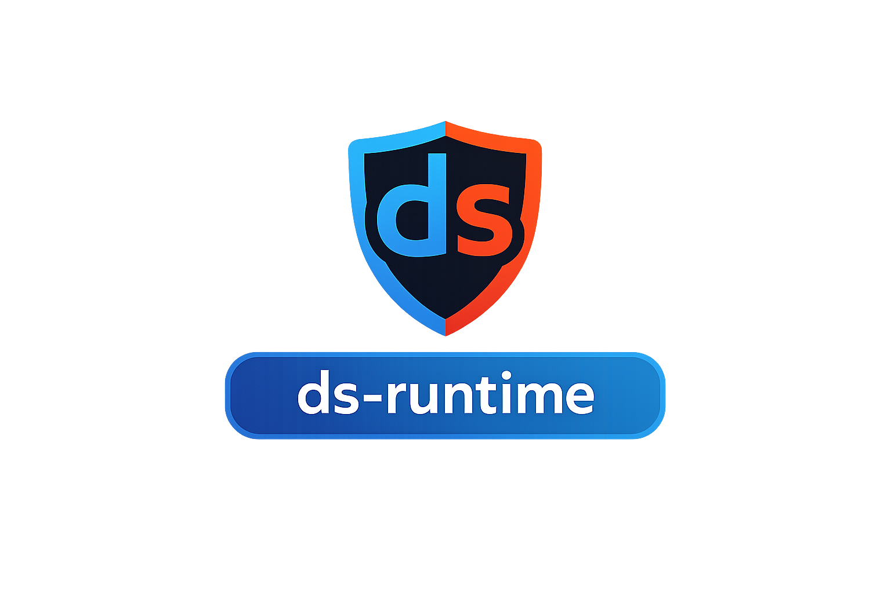

# ds-runtime

<p align="center">
  <a href="https://github.com/infinityabundance/ds-runtime">
    
  </a>
</p>
=======
<p align="center">
  
  
  
  
  
  
</p>

[](https://deepwiki.com/infinityabundance/ds-runtime)


<p align="center">
Experimental Linux-native DirectStorage-style runtime (CPU today, GPU tomorrow) with an early GPU/Vulkan backend, towards Wine/Proton integration. 


## 🔎 Overview

ds-runtime is an experimental C++ runtime that explores how a
DirectStorage-style I/O and decompression pipeline can be implemented natively on Linux.

The project focuses on:

- Clean, idiomatic systems-level C++

- Explicit and auditable concurrency

- POSIX-first file I/O

- A backend-based architecture that cleanly separates:

- request orchestration (queues, lifetime, synchronization)

- execution backends (CPU now, Vulkan/GPU planned)

The long-term motivation is to provide a solid architectural foundation for a
native Linux implementation of DirectStorage-like workloads, suitable for eventual integration with Wine / Proton.

This repository intentionally prioritizes structure, clarity, and correctness over premature optimization.

---
## 🚧 Project status

- **Status:** Experimental  
- **Backend: CPU** ✅ **Fully Implemented and Working**
- **GPU/Vulkan backend:** Experimental (staging buffer copies only, no GPU compute yet)
- **io_uring backend:** Experimental (host memory only, requires liburing)

### Recent Updates (Phase 40-45 Complete)
The codebase has been significantly improved:
- ✅ **All build-breaking issues fixed** - compiles cleanly
- ✅ **CPU backend fully functional** - all tests passing
- ✅ **Comprehensive test suite** - 4 test suites with 100% pass rate
- ✅ **Enhanced C ABI** - proper enum support and bytes_transferred tracking
- ✅ **Error handling** - robust error reporting with rich context
- ✅ **Request management** - take_completed() API works correctly

### Test Coverage
- **basic_queue_test**: Core queue operations
- **cpu_backend_test**: Read/write, partial reads, compression, concurrent ops
- **error_handling_test**: Invalid FD, missing files, error context
- **gdeflate_stub_test**: Unsupported compression error handling

### What Works
- ✅ CPU backend with thread pool
- ✅ Read and write operations
- ✅ FakeUppercase demo compression
- ✅ Error reporting with callbacks
- ✅ Request completion tracking
- ✅ Partial read handling
- ✅ C ABI for Wine/Proton integration
- ✅ Multiple concurrent requests

### Known Limitations
- ⚠️ **GDeflate compression**: Returns ENOTSUP error (intentional stub - requires format specification)
- ⚠️ **Vulkan GPU compute**: Only staging buffer copies work, compute pipelines not implemented
- ⚠️ **io_uring backend**: Requires liburing dependency (not built by default)
- ⚠️ **Request cancellation**: Enum added but cancel() method not yet implemented

### 📋 Investigation & Planning Complete (Phase 0)
Comprehensive investigation and planning documents have been created:
- **[Master Roadmap](docs/master_roadmap.md)** (30KB) - Complete 36-week phased plan with microtasks
- **[GDeflate Investigation](docs/investigation_gdeflate.md)** (16KB) - CPU & GPU implementation plan
- **[Vulkan Compute Investigation](docs/investigation_vulkan_compute.md)** (26KB) - GPU compute pipelines
- **[io_uring Investigation](docs/investigation_io_uring.md)** (20KB) - Multi-worker backend enhancement
- **[Additional Features](docs/investigation_remaining_features.md)** (18KB) - Cancellation, GPU workflows, Wine/Proton

Timeline: 36 weeks for full implementation, 12 weeks for MVP

See [MISSING_FEATURES.md](MISSING_FEATURES.md) for the complete roadmap and [COMPARISON.md](COMPARISON.md) for documentation vs reality comparison.

---

## ℹ️ What this is (and isn’t)

This is:

- A reference-quality runtime skeleton

- A clean async I/O queue with pluggable backends

- A realistic starting point for Linux-native asset streaming

- A codebase meant to be read, reviewed, and extended

This is not:

- A drop-in replacement for Microsoft DirectStorage

- A performance benchmark

- A full GPU decompression implementation (yet)

- Production-ready middleware

---

## 🎯 Why this matters

Modern games increasingly rely on DirectStorage-style I/O to stream large assets
(textures, meshes, shaders) efficiently from disk to memory and GPU. On Windows,
DirectStorage provides a standardized API that reduces CPU overhead, minimizes
copying, and enables better asset streaming at scale.

On Linux, no equivalent native API exists today.

As a result, Proton/Wine-based games that depend on DirectStorage semantics must
either:
- Fall back to legacy, CPU-heavy I/O paths, or
- Emulate Windows behavior in user space with limited visibility into Linux-native
  async I/O, memory management, and GPU synchronization.

This creates a structural gap.

### The problem space

Without a native Linux-side abstraction:
- Asset streaming is fragmented across engines and ad-hoc thread pools
- CPU cores are wasted on I/O and decompression work that could be pipelined or
  offloaded
- GPU upload paths are often bolted on after the fact rather than designed into
  the I/O model
- Proton/Wine must translate Windows semantics without a clear Linux analogue

DirectStorage is not just “faster file I/O” — it is an architectural contract
between the game, the OS, and the GPU.

### What a native Linux approach enables

A Linux-native DirectStorage-style runtime enables:
- A **clear, explicit async I/O model** built on Linux primitives
  (e.g. thread pools today, io_uring tomorrow)
- **Batching and queue-based submission** that matches how modern engines
  structure asset streaming
- A **first-class path from disk → CPU → GPU**, rather than implicit or
  engine-specific glue
- Cleaner **integration points for Wine/Proton**, avoiding opaque shims or
  duplicated logic
- An evolution path toward **GPU-assisted decompression and copies** via Vulkan

This is not about copying Windows APIs verbatim. It is about providing a native
Linux abstraction that maps cleanly onto modern storage, memory, and GPU systems.

### Why ds-runtime exists

`ds-runtime` explores what such a runtime could look like on Linux:

- A small, explicit request/queue model inspired by DirectStorage semantics
- Pluggable backends (CPU today, Vulkan/GPU tomorrow)
- A stable C ABI suitable for integration into Wine/Proton or engines
- Clear ownership, lifetime, and synchronization rules
- Documentation that treats integration as a first-class concern

Even partial adoption of these ideas can reduce duplication, clarify I/O paths,
and make asset streaming behavior more predictable on Linux.

The long-term goal is not to replace engines or drivers, but to provide a shared,
understandable foundation for high-performance game I/O on Linux.

---

## 🧱 High-level architecture
```
┌─────────────┐
│   Client    │
│ (game/app)  │
└──────┬──────┘
       │ enqueue Request
       ▼
┌─────────────┐
│  ds::Queue  │   ← orchestration, lifetime, waiting
└──────┬──────┘
       │ submit
       ▼
┌────────────────────┐
│   ds::Backend      │   ← execution (CPU / Vulkan / future)
└────────────────────┘
```
See [docs/design.md](docs/design.md) for details on backend evolution.

---

## 💡 Core concepts

`ds::Request`

Describes what to load:

- POSIX file descriptor

- Byte offset

- Size

- Destination pointer

- Optional GPU buffer/offset for Vulkan-backed transfers

- Operation (read/write)

- Memory location (host or GPU buffer)

- Compression mode

- Optional GPU buffer handle + offset when using the Vulkan backend

- Completion status / error

This maps cleanly to:

- Linux I/O semantics

- DirectStorage request descriptors

- Future GPU-resident workflows

`ds::Queue`

Responsible for:

- Collecting requests

- Submitting them to a backend

- Tracking in-flight work

- Optional blocking via `wait_all()`

- Retrieving completed requests via `take_completed()`

The queue **does not perform I/O itself**.

`ds::Backend`

Abstract execution interface.

Error reporting:

- `ds::set_error_callback` installs a process-wide hook for rich diagnostics
- `ds::report_error` emits subsystem/operation/file/line context and timestamps
- `ds::report_request_error` adds request-specific fields (fd/offset/size/memory)

Current implementation:

- **CPU backend**

- `pread()`/`pwrite()`-based I/O

- **Vulkan backend (experimental)**

- `pread()`/`pwrite()` plus Vulkan staging buffer copies to GPU buffers

- **io_uring backend (experimental)**

- `io_uring` host I/O path (host memory only)

- Small internal thread pool

- Demo “decompression” stage (uppercase transform); GDeflate is stubbed

Planned backends:

- Vulkan compute backend (GPU copy / decompression)

- Vendor-specific GPU paths

---

## 🎨 Why this design?

This mirrors how real DirectStorage systems are structured:

- A front-end queue API

- A backend that owns execution and synchronization

- Clear separation between:

- disk I/O

- decompression

- GPU involvement

Keeping these layers explicit makes the code:

- Easier to reason about

- Easier to test

- Easier to extend without rewrites

- Code hygiene goals

The project follows conventions expected by experienced Linux developers:

- Header / implementation split

- No global state

- RAII throughout

- Direct use of POSIX APIs (open, pread, close)

- No exceptions crossing public API boundaries

- Minimal but explicit threading

- No macro or template magic

- If something happens, it should be obvious where and why.

---

## Wine 🍷 / Proton 🧪

Modern Windows titles increasingly rely on DirectStorage-style APIs for
asset streaming and decompression. On Linux, these calls are currently
handled via compatibility-layer shims or fall back to traditional I/O paths.

This project explores what a **native Linux runtime** for DirectStorage-like
workloads could look like, with an emphasis on:

- Correct API semantics
- Clean separation between queue orchestration and execution
- Explicit backend design (CPU today, GPU later)
- Compatibility with Wine / Proton architecture

The current implementation focuses on a **CPU backend** that provides:
- Asynchronous I/O semantics
- Explicit completion tracking
- A decompression stage hook (currently a demo transform)

This is intended as a **foundational layer** that could back a future
`dstorage.dll` implementation in Wine/Proton, with GPU acceleration added
incrementally once semantics and integration points are validated.

For integration guidance (including a no-shim option), see
[docs/wine_proton.md](docs/wine_proton.md). For Arch Linux–specific Vulkan
notes, see [docs/archlinux_vulkan_integration.md](docs/archlinux_vulkan_integration.md).

--- 

## 🎬 Demo

The included demo program:

- Writes a small test asset to disk

- Enqueues two asynchronous requests:

- One raw read

- One “compressed” read (fake uppercase transform)

- Submits them concurrently

- Waits for completion

- Prints the results

Example output:

``` 
[demo] starting DirectStorage-style CPU demo
[demo] wrote 41 bytes to demo_asset.bin
[demo] submitting 2 requests
[demo] waiting for completion (in-flight=2)
[demo] all requests completed (in-flight=0)
raw   : "Hello DirectStorage-style queue on Linux!"
upper : "HELLO DIRECTSTORAGE-STYLE QUEUE ON LINUX!"

``` 

Additional demo:

- `ds_asset_streaming` writes a packed asset file and issues concurrent reads,
  exercising request offsets and the error reporting callback.
---

## 🛠️ Building

### Requirements

Linux

C++20 compiler (Clang or GCC)

pthreads

CMake ≥ 3.16

Vulkan SDK (optional, required for the Vulkan backend)

liburing (optional, required for the io_uring backend)

### Build steps

```bash 
git clone https://github.com/infinityabundance/ds-runtime.git
cd ds-runtime


mkdir build
cd build
cmake ..
cmake --build .
``` 
Run the demo:

```bash 
# from inside build/examples/
./ds_demo
``` 

### Tests

Enable tests with:

```bash
cmake -B build -S . -DDS_BUILD_TESTS=ON
cmake --build build
ctest --test-dir build
```

Run the asset streaming demo:

```bash
# from inside build/examples/
./ds_asset_streaming
```

### Shared library + C API

The build produces a shared object `libds_runtime.so` that exposes both the
C++ API (`include/ds_runtime.hpp`) and a C-compatible ABI (`include/ds_runtime_c.h`).
This makes it easier to integrate the runtime with non-C++ code or FFI layers
like Wine or Proton shims.

To link against the shared object from another project:

```bash
cc -I/path/to/ds-runtime/include \
   -L/path/to/ds-runtime/build \
   -lds_runtime \
   your_app.c
```

### Vulkan backend (experimental)

When built with Vulkan, you can construct a Vulkan backend and submit requests
with `RequestMemory::Gpu` to move data between files and GPU buffers. Requests
use `gpu_buffer` + `gpu_offset` to identify the destination/source GPU buffer.
---

## 🔭 Repository layout
``` 

├── CMakeLists.txt            # Top-level CMake build configuration
│
├── include/                  # Public C++ API headers
│   └── ds_runtime.hpp        # Core DirectStorage-style runtime interface
│   └── ds_runtime_vulkan.hpp # Vulkan backend interface (experimental)
│   └── ds_runtime_uring.hpp  # io_uring backend interface (experimental)
│
├── src/                      # Runtime implementation
│   └── ds_runtime.cpp        # Queue, backend, and CPU execution logic
│   └── ds_runtime_vulkan.cpp # Vulkan backend implementation
│   └── ds_runtime_uring.cpp  # io_uring backend implementation
│
├── examples/                 # Standalone example programs
│   ├── ds_demo_main.cpp      # CPU-only demo exercising ds::Queue and requests
│   ├── asset_streaming_main.cpp # Asset streaming demo with concurrent reads
│   │
│   └── vk-copy-test/         # Experimental Vulkan groundwork
│       ├── copy.comp         # Vulkan compute shader (GLSL)
│       ├── copy.comp.spv     # Precompiled SPIR-V shader
│       ├── demo_asset.bin    # Small test asset for GPU copy
│       ├── vk_copy_test.cpp  # Vulkan copy demo (CPU → GPU → CPU)
├── docs/                     # Design and architecture documentation
│   └── design.md             # Backend evolution and architectural notes
│
├── assets/                   # Non-code assets used by documentation
│   └── logo.png              # Project logo displayed in README
│
├── README.md                 # Project overview, build instructions, roadmap
└── LICENSE                   # Apache-2.0 license
``` 
---

## 🧩 Relationship to DirectStorage, Wine, and Proton

This project is not affiliated with Microsoft, Valve, or the Wine project.

However, it is intentionally structured so that:

- `ds::Request` can map to `DSTORAGE_REQUEST_DESC`

- `ds::Queue` can map to a DirectStorage queue object

- A Vulkan backend can integrate with Proton’s D3D12 → Vulkan interop

The goal is to explore what a **native Linux DirectStorage-style runtime** could look like, with real code and real execution paths.

---

## 🛣️ Roadmap (rough)

 🚨 **Fix build issues** (missing fields/methods - CRITICAL)

 ⚠️ Vulkan backend (staging buffer copies working, compute pipeline TODO)

 ◻️ Real compression format (CPU GDeflate first)

 ⚠️ `io_uring` backend (host memory, needs verification)

 ◻️ Wine / Proton integration experiments

 ◻️ Real-world game testing

This project intentionally starts small and correct. See [MISSING_FEATURES.md](MISSING_FEATURES.md) for detailed status.

---

## 🌱 Contributing

Discussion, feedback, and code review are welcome.

If you are a:

- Linux systems developer

- Graphics / Vulkan developer

- Wine or Proton contributor

…your perspective is especially appreciated.

---

## 🪪 License

This project is licensed under the Apache License 2.0.
See the LICENSE file for details.

---

## 📝 Final note

Linux deserves first-class asset streaming paths — not just compatibility shims.

Even if this repository never becomes the solution, it aims to push that discussion forward with real, auditable code rather than speculation.

---
